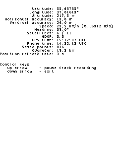

[По-русски](README-ru.md)

# GPS track recorder for Symbian S60 (console version)
Writes your way to file. Works on Nokia phones with S60 3rd and 5th editions.

## Features
* Save recorded track to GPX 1.1 format
* Automatically change position update rate (from 1 to 10 seconds) depending on current speed for saving battery
* Write infromation to file: latitude and longitude, altitude, time, dilutions of precision, speed, course, amount of used satellites
* Pause tracking

## Screenshots
<kbd></kbd>

## Track samples
* [https://www.openstreetmap.org/user/artem78/traces/3149367](https://www.openstreetmap.org/user/artem78/traces/3149367)

## Compatibility
S60 based phone with Symbian 9.1-9.4 and with internal GPS-reciever.

Tested on Nokia N95 8GB. If you can help me to test this software on other S60 based phones, please [contact me](#author).

## Installation
Download from [release page](../../../releases) `sis` or `sisx` file and install it to the phone.

***You must sign installation package before install or use unlocked phone!***

## Using
Control keys:

* Arrow up - pause track recording
* Arrow down - exit from program

Tracks save to GPX files in directory `C:\data\GPSTracker\tracks\` or `E:\data\GPSTracker\tracks\`, depending on which drive program have been installed.

## Problems
If you find any bug or want to suggest an idea, you can [contact me](#author) or write to the [issue page](../../../issues).

## Future plans
* [x] ~Make graphical user interface~ ([here](https://github.com/artem78/s60-gps-tracker))
* Saving to other formats (KML, NMEA, etc...)

## Author
Artem78 ([megabyte1024@ya.ru](mailto:megabyte1024@ya.ru))

## License
This software is released under [GNU GPLv3 license](/LICENSE.txt).

## Author`s notes
This software was originally created for personal use on my old Nokia phone. I will be glad, if it will be usefull for anyone else.

## See also
* [The same program with graphical user interface](https://github.com/artem78/s60-gps-tracker)
